# K8s From-Ground-Up

For a better understanding of each aspect of spinning up a Kubernetes cluster, we will do it without any automated helpers. You will install each and every component manually from scratch and learn how to make them work together.

## Let us begin!!! 

**Step One: INSTALL CLIENT TOOLS BEFORE BOOTSTRAPPING THE CLUSTER.**

- Aws CLI - is a unified tool to manage your AWS services.
- Kubectl - this command line utility will be your main control tool to manage your K8s cluster.
- cfssl - an open source toolkit for everything TLS/SSL from Cloudflare
- cfssljson -  a program, which takes the JSON output from the cfssl and writes certificates, keys, CSRs, and bundles to disk.

***Installing kubectl***

```bash
#Download the binary
wget https://storage.googleapis.com/kubernetes-release/release/v1.21.0/bin/linux/amd64/kubectl

# Make it executable
chmod +x kubectl

# Move to the Bin directory
sudo mv kubectl /usr/local/bin/

# Verify that kubectl version 1.21.0 or higher is installed:
kubectl version --client
```


***Install CFSSL and CFSSLJSON***

***ccfssl*** is an open source tool by Cloudflare used to setup a Public Key Infrastructure (PKI Infrastructure) for generating, signing and bundling TLS certificates. In previous projects you have experienced the use of Letsencrypt for the similar use case. Here, cfssl will be configured as a Certificate Authority which will issue the certificates required to spin up a Kubernetes cluster.

```bash

# Download cfssl, cfssljson and other bundles
 wget -q --show-progress --https-only --timestamping \
>   https://storage.googleapis.com/kubernetes-the-hard-way/cfssl/1.4.1/linux/cfssl \
>   https://storage.googleapis.com/kubernetes-the-hard-way/cfssl/1.4.1/linux/cfssljson

chmod +x cfssl cfssljson

sudo mv cfssl cfssljson /usr/local/bin/
```


***AWS CLOUD RESOURCES FOR KUBERNETES CLUSTER***

## Step 1 – Configure Network Infrastructure 

```bash
# 1. Create a directory named k8s-cluster-from-ground-up
mkdir k8s-cluster-from-ground-up

# 2. Create a VPC and store the ID as a variable:
VPC_ID=$(aws ec2 create-vpc \
--cidr-block 172.31.0.0/16 \
--output text --query 'Vpc.VpcId'
)

# 3. Tag the VPC so that it is named:
NAME=k8s-cluster-from-ground-up

aws ec2 create-tags \
  --resources ${VPC_ID} \
  --tags Key=Name,Value=${NAME}
```


**Domain Name System – DNS**

DNS resolution is enabled by default but not DNS hostname

```bash

# 4. Enable DNS hostnames:
aws ec2 modify-vpc-attribute \
--vpc-id ${VPC_ID} \
--enable-dns-hostnames '{"Value": true}'

 # 5. Set the required region
 AWS_REGION=eu-central-1
 ```


***Dynamic Host Configuration Protocol – DHCP***

AWS automatically creates and associates a DHCP option set for your Amazon VPC upon creation and sets two options: domain-name-servers (defaults to AmazonProvidedDNS) and domain-name (defaults to the domain name for your set region). AmazonProvidedDNS is an Amazon Domain Name System (DNS) server, and this option enables DNS for instances to communicate using DNS names.

```bash
# 6. Configure DHCP Options Set
DHCP_OPTION_SET_ID=$(aws ec2 create-dhcp-options \
  --dhcp-configuration \
    "Key=domain-name,Values=$AWS_REGION.compute.internal" \
    "Key=domain-name-servers,Values=AmazonProvidedDNS" \
  --output text --query 'DhcpOptions.DhcpOptionsId')

# 7. Tag the DHCP Option Set
aws ec2 create-tags \
  --resources ${DHCP_OPTION_SET_ID} \
  --tags Key=Name,Value=${NAME}

```

 


```bash
# 8. Associate the DHCP Option set with the VPC:
aws ec2 associate-dhcp-options \
  --dhcp-options-id ${DHCP_OPTION_SET_ID} \
  --vpc-id ${VPC_ID}
  ```


```bash
# 9 Create the Subnet
SUBNET_ID=$(aws ec2 create-subnet \
  --vpc-id ${VPC_ID} \
  --cidr-block 172.31.0.0/24 \
  --output text --query 'Subnet.SubnetId')

# 10. Add tag to Subnet
aws ec2 create-tags \
  --resources ${SUBNET_ID} \
  --tags Key=Name,Value=${NAME}
```


```bash
# 11. Create the Internet Gateway and attach it to the VPC
INTERNET_GATEWAY_ID=$(aws ec2 create-internet-gateway \
  --output text --query 'InternetGateway.InternetGatewayId')

# 12. Tag Internet gateway  
aws ec2 create-tags \
  --resources ${INTERNET_GATEWAY_ID} \
  --tags Key=Name,Value=${NAME}

# 13. Attach Internet Gateway to VPC
aws ec2 attach-internet-gateway \
  --internet-gateway-id ${INTERNET_GATEWAY_ID} \
  --vpc-id ${VPC_ID}
```


```bash
# 14. Create route tables

ROUTE_TABLE_ID=$(aws ec2 create-route-table \
  --vpc-id ${VPC_ID} \
  --output text --query 'RouteTable.RouteTableId')

# 15. Tag the route table

aws ec2 create-tags \
  --resources ${ROUTE_TABLE_ID} \
  --tags Key=Name,Value=${NAME}

# 16. Associate the route table to subnet

aws ec2 associate-route-table \
  --route-table-id ${ROUTE_TABLE_ID} \
  --subnet-id ${SUBNET_ID}

# 17. Create a route to allow external traffic to the Internet through the Internet Gateway

aws ec2 create-route \
  --route-table-id ${ROUTE_TABLE_ID} \
  --destination-cidr-block 0.0.0.0/0 \
  --gateway-id ${INTERNET_GATEWAY_ID}
```


***Configure security groups***

```bash

# 18. Create the security group and store its ID in a variable
SECURITY_GROUP_ID=$(aws ec2 create-security-group \
  --group-name ${NAME} \
  --description "Kubernetes cluster security group" \
  --vpc-id ${VPC_ID} \
  --output text --query 'GroupId')

# Create the NAME tag for the security group
aws ec2 create-tags \
  --resources ${SECURITY_GROUP_ID} \
  --tags Key=Name,Value=${NAME}


# Create Inbound traffic for all communication within the subnet to connect on ports used by the master node(s)
aws ec2 authorize-security-group-ingress \
    --group-id ${SECURITY_GROUP_ID} \
    --ip-permissions IpProtocol=tcp,FromPort=2379,ToPort=2380,IpRanges='[{CidrIp=172.31.0.0/24}]'

# # Create Inbound traffic for all communication within the subnet to connect on ports used by the worker nodes
aws ec2 authorize-security-group-ingress \
    --group-id ${SECURITY_GROUP_ID} \
    --ip-permissions IpProtocol=tcp,FromPort=30000,ToPort=32767,IpRanges='[{CidrIp=172.31.0.0/24}]'

# Create inbound traffic to allow connections to the Kubernetes API Server listening on port 6443
aws ec2 authorize-security-group-ingress \
  --group-id ${SECURITY_GROUP_ID} \
  --protocol tcp \
  --port 6443 \
  --cidr 0.0.0.0/0

# Create Inbound traffic for SSH from anywhere (Do not do this in production. Limit access ONLY to IPs or CIDR that MUST connect)
aws ec2 authorize-security-group-ingress \
  --group-id ${SECURITY_GROUP_ID} \
  --protocol tcp \
  --port 22 \
  --cidr 0.0.0.0/0

# Create ICMP ingress for all types
aws ec2 authorize-security-group-ingress \
  --group-id ${SECURITY_GROUP_ID} \
  --protocol icmp \
  --port -1 \
  --cidr 0.0.0.0/0
```


***Network Load Balancer***

```bash
# 19. Create a network Load balancer

LOAD_BALANCER_ARN=$(aws elbv2 create-load-balancer \
--name ${NAME} \
--subnets ${SUBNET_ID} \
--scheme internet-facing \
--type network \
--output text --query 'LoadBalancers[].LoadBalancerArn')

```


***Tagret Group***

*For now, it will be unhealthy because there are no real targets yet.*

```bash 
# 20. Create a target group:

TARGET_GROUP_ARN=$(aws elbv2 create-target-group \
  --name ${NAME} \
  --protocol TCP \
  --port 6443 \
  --vpc-id ${VPC_ID} \
  --target-type ip \
  --output text --query 'TargetGroups[].TargetGroupArn')

 # .21 Register targets - (Just like above, no real targets. You will just put the IP addresses so that, when the nodes become available, they will be used as targets.)
aws elbv2 register-targets \
  --target-group-arn ${TARGET_GROUP_ARN} \
  --targets Id=172.31.0.1{0,1,2}
```

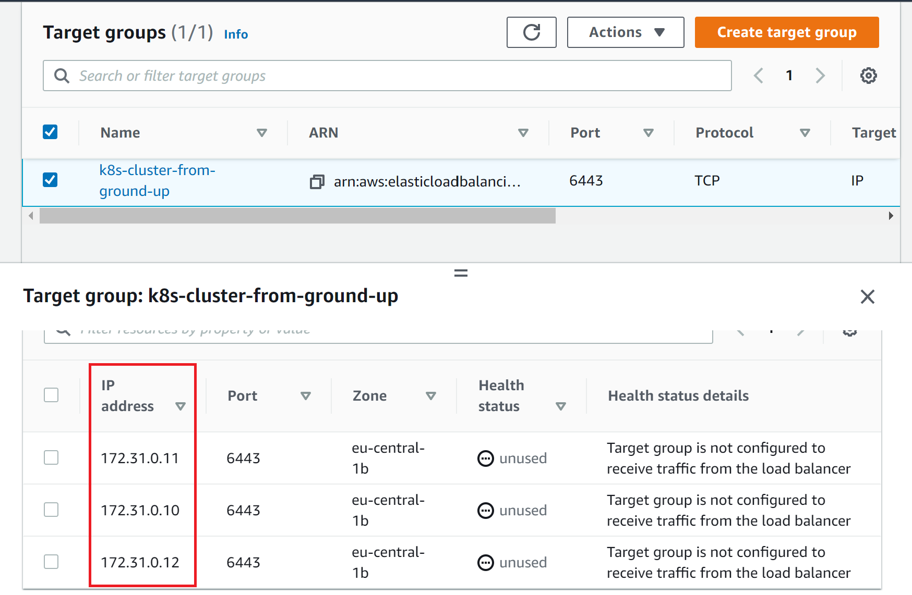

```bash
# 22. Create a listener to listen for requests and forward to the target nodes on TCP port 6443

aws elbv2 create-listener \
--load-balancer-arn ${LOAD_BALANCER_ARN} \
--protocol TCP \
--port 6443 \
--default-actions Type=forward,TargetGroupArn=${TARGET_GROUP_ARN} \
--output text --query 'Listeners[].ListenerArn'
```


```bash
# 23. Get the Kubernetes Public address
KUBERNETES_PUBLIC_ADDRESS=$(aws elbv2 describe-load-balancers \
--load-balancer-arns ${LOAD_BALANCER_ARN} \
--output text --query 'LoadBalancers[].DNSName')
```

## Step 2 – Create Compute Resources

```bash
# Get an image to create EC2 instances
IMAGE_ID=$(aws ec2 describe-images --owners 099720109477 \
  --filters \
  'Name=root-device-type,Values=ebs' \
  'Name=architecture,Values=x86_64' \
  'Name=name,Values=ubuntu/images/hvm-ssd/ubuntu-xenial-16.04-amd64-server-*' \
  | jq -r '.Images|sort_by(.Name)[-1]|.ImageId')


# Create SSH Key-Pair *k8s-cluster-from-ground-up.id_rsa*
mkdir -p ssh

aws ec2 create-key-pair \
  --key-name ${NAME} \
  --output text --query 'KeyMaterial' \
  > ssh/${NAME}.id_rsa
chmod 600 ssh/${NAME}.id_rsa
```

***EC2 Instances for Controle Plane (Master Nodes)***

```bash
# Create 3 Master nodes

for i in 0 1 2; do
  instance_id=$(aws ec2 run-instances \
    --associate-public-ip-address \
    --image-id ${IMAGE_ID} \
    --count 1 \
    --key-name ${NAME} \
    --security-group-ids ${SECURITY_GROUP_ID} \
    --instance-type t2.micro \
    --private-ip-address 172.31.0.1${i} \
    --user-data "name=master-${i}" \
    --subnet-id ${SUBNET_ID} \
    --output text --query 'Instances[].InstanceId')
  aws ec2 modify-instance-attribute \
    --instance-id ${instance_id} \
    --no-source-dest-check
  aws ec2 create-tags \
    --resources ${instance_id} \
    --tags "Key=Name,Value=${NAME}-master-${i}"
done

```


***EC2 Instances for Worker Nodes***

```bash
# Create 3 worker nodes
for i in 0 1 2; do
  instance_id=$(aws ec2 run-instances \
    --associate-public-ip-address \
    --image-id ${IMAGE_ID} \
    --count 1 \
    --key-name ${NAME} \
    --security-group-ids ${SECURITY_GROUP_ID} \
    --instance-type t2.micro \
    --private-ip-address 172.31.0.2${i} \
    --user-data "name=worker-${i}|pod-cidr=172.20.${i}.0/24" \
    --subnet-id ${SUBNET_ID} \
    --output text --query 'Instances[].InstanceId')
  aws ec2 modify-instance-attribute \
    --instance-id ${instance_id} \
    --no-source-dest-check
  aws ec2 create-tags \
    --resources ${instance_id} \
    --tags "Key=Name,Value=${NAME}-worker-${i}"
done
```


## Step 3 Prepare The Self-Signed Certificate Authority And Generate TLS Certificates

The following components running on the ***Master*** node will require TLS certificates.

- kube-controller-manager
- kube-scheduler
- etcd
- kube-apiserver

The following components running on the ***Worker*** nodes will require TLS certificates.

- kubelet
- kube-proxy

***Self-Signed Root Certificate Authority (CA)***

Here, you will provision a CA that will be used to sign additional TLS certificates.

Create a directory and cd into it:

```bash
mkdir ca-authority && cd ca-authority
```
Generate the CA configuration file, Root Certificate, and Private key:

```bash
{

cat > ca-config.json <<EOF
{
  "signing": {
    "default": {
      "expiry": "8760h"
    },
    "profiles": {
      "kubernetes": {
        "usages": ["signing", "key encipherment", "server auth", "client auth"],
        "expiry": "8760h"
      }
    }
  }
}
EOF

cat > ca-csr.json <<EOF
{
  "CN": "Kubernetes",
  "key": {
    "algo": "rsa",
    "size": 2048
  },
  "names": [
    {
      "C": "UK",
      "L": "England",
      "O": "Kubernetes",
      "OU": "DAREY.IO DEVOPS",
      "ST": "London"
    }
  ]
}
EOF

cfssl gencert -initca ca-csr.json | cfssljson -bare ca

}
```

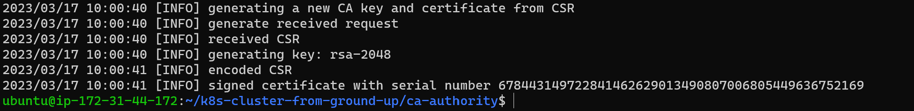

***Generating TLS Certificates For Client and Server***

Now we have a certificate for the Root CA, we can then begin to request more certificates which the different Kubernetes components, i.e. clients and server, will use to have encrypted communication.

Remember, the clients here refer to every other component that will communicate with the api-server. These are:

- kube-controller-manager
- kube-scheduler
- etcd
- kubelet
- kube-proxy
- Kubernetes Admin User

***Let us begin with the Kubernetes API-Server Certificate and Private Key***

The certificate for the Api-server must have IP addresses, DNS names, and a Load Balancer address included. Otherwise, you will have a lot of difficulties connecting to the api-server.

```bash
# Generate the Certificate Signing Request (CSR), Private Key and the Certificate for the Kubernetes Master Nodes.

{
cat > master-kubernetes-csr.json <<EOF
{
  "CN": "kubernetes",
   "hosts": [
   "127.0.0.1",
   "172.31.0.10",
   "172.31.0.11",
   "172.31.0.12",
   "ip-172-31-0-10",
   "ip-172-31-0-11",
   "ip-172-31-0-12",
   "ip-172-31-0-10.${AWS_REGION}.compute.internal",
   "ip-172-31-0-11.${AWS_REGION}.compute.internal",
   "ip-172-31-0-12.${AWS_REGION}.compute.internal",
   "${KUBERNETES_PUBLIC_ADDRESS}",
   "kubernetes",
   "kubernetes.default",
   "kubernetes.default.svc",
   "kubernetes.default.svc.cluster",
   "kubernetes.default.svc.cluster.local"
  ],
  "key": {
    "algo": "rsa",
    "size": 2048
  },
  "names": [
    {
      "C": "UK",
      "L": "England",
      "O": "Kubernetes",
      "OU": "DAREY.IO DEVOPS",
      "ST": "London"
    }
  ]
}
EOF

cfssl gencert \
  -ca=ca.pem \
  -ca-key=ca-key.pem \
  -config=ca-config.json \
  -profile=kubernetes \
  master-kubernetes-csr.json | cfssljson -bare master-kubernetes
}
```


Next, let's creating the other certificates: for the following Kubernetes components:

- Scheduler Client Certificate
- Kube Proxy Client Certificate
- Controller Manager Client Certificate
- Kubelet Client Certificates
- K8s admin user Client Certificate

```bash
# kube-scheduler Client Certificate and Private Key
{

cat > kube-scheduler-csr.json <<EOF
{
  "CN": "system:kube-scheduler",
  "key": {
    "algo": "rsa",
    "size": 2048
  },
  "names": [
    {
      "C": "UK",
      "L": "England",
      "O": "system:kube-scheduler",
      "OU": "DAREY.IO DEVOPS",
      "ST": "London"
    }
  ]
}
EOF

cfssl gencert \
  -ca=ca.pem \
  -ca-key=ca-key.pem \
  -config=ca-config.json \
  -profile=kubernetes \
  kube-scheduler-csr.json | cfssljson -bare kube-scheduler

}
```

```bash
# kube-proxy Client Certificate and Private Key

{

cat > kube-proxy-csr.json <<EOF
{
  "CN": "system:kube-proxy",
  "key": {
    "algo": "rsa",
    "size": 2048
  },
  "names": [
    {
      "C": "UK",
      "L": "England",
      "O": "system:node-proxier",
      "OU": "DAREY.IO DEVOPS",
      "ST": "London"
    }
  ]
}
EOF

cfssl gencert \
  -ca=ca.pem \
  -ca-key=ca-key.pem \
  -config=ca-config.json \
  -profile=kubernetes \
  kube-proxy-csr.json | cfssljson -bare kube-proxy

}
```

```bash
# kube-controller-manager Client Certificate and Private Key

{
cat > kube-controller-manager-csr.json <<EOF
{
  "CN": "system:kube-controller-manager",
  "key": {
    "algo": "rsa",
    "size": 2048
  },
  "names": [
    {
      "C": "UK",
      "L": "England",
      "O": "system:kube-controller-manager",
      "OU": "DAREY.IO DEVOPS",
      "ST": "London"
    }
  ]
}
EOF

cfssl gencert \
  -ca=ca.pem \
  -ca-key=ca-key.pem \
  -config=ca-config.json \
  -profile=kubernetes \
  kube-controller-manager-csr.json | cfssljson -bare kube-controller-manager

}
```

***kubelet Client Certificate and Private Key***

Similar to how you configured the api-server's certificate, Kubernetes requires that the hostname of each worker node is included in the client certificate.

Also, Kubernetes uses a special-purpose authorization mode called Node Authorizer, that specifically authorizes API requests made by kubelet services. In order to be authorized by the Node Authorizer, kubelets must use a credential that identifies them as being in the system:nodes group, with a username of `system:node:<nodeName>`. Notice the "CN": "system:node:${instance_hostname}", in the below code.

```bash
for i in 0 1 2; do
  instance="${NAME}-worker-${i}"
  instance_hostname="ip-172-31-0-2${i}"
  cat > ${instance}-csr.json <<EOF
{
  "CN": "system:node:${instance_hostname}",
  "key": {
    "algo": "rsa",
    "size": 2048
  },
  "names": [
    {
      "C": "UK",
      "L": "England",
      "O": "system:nodes",
      "OU": "DAREY.IO DEVOPS",
      "ST": "London"
    }
  ]
}
EOF

  external_ip=$(aws ec2 describe-instances \
    --filters "Name=tag:Name,Values=${instance}" \
    --output text --query 'Reservations[].Instances[].PublicIpAddress')

  internal_ip=$(aws ec2 describe-instances \
    --filters "Name=tag:Name,Values=${instance}" \
    --output text --query 'Reservations[].Instances[].PrivateIpAddress')

  cfssl gencert \
    -ca=ca.pem \
    -ca-key=ca-key.pem \
    -config=ca-config.json \
    -hostname=${instance_hostname},${external_ip},${internal_ip} \
    -profile=kubernetes \
    ${NAME}-worker-${i}-csr.json | cfssljson -bare ${NAME}-worker-${i}
done
```

***Finally, kubernetes admin user's Client Certificate and Private Key***

```bash
{
cat > admin-csr.json <<EOF
{
  "CN": "admin",
  "key": {
    "algo": "rsa",
    "size": 2048
  },
  "names": [
    {
      "C": "UK",
      "L": "England",
      "O": "system:masters",
      "OU": "DAREY.IO DEVOPS",
      "ST": "London"
    }
  ]
}
EOF

cfssl gencert \
  -ca=ca.pem \
  -ca-key=ca-key.pem \
  -config=ca-config.json \
  -profile=kubernetes \
  admin-csr.json | cfssljson -bare admin
}
```

We need one more pair of certificate and private key we need to generate. That is for the Token Controller: a part of the Kubernetes Controller Manager kube-controller-manager responsible for generating and signing service account tokens which are used by pods or other resources to establish connectivity to the api-server.

Let's create the last set of files, and we are done with PKIs

```bash
{

cat > service-account-csr.json <<EOF
{
  "CN": "service-accounts",
  "key": {
    "algo": "rsa",
    "size": 2048
  },
  "names": [
    {
      "C": "UK",
      "L": "England",
      "O": "Kubernetes",
      "OU": "DAREY.IO DEVOPS",
      "ST": "London"
    }
  ]
}
EOF

cfssl gencert \
  -ca=ca.pem \
  -ca-key=ca-key.pem \
  -config=ca-config.json \
  -profile=kubernetes \
  service-account-csr.json | cfssljson -bare service-account
}
```

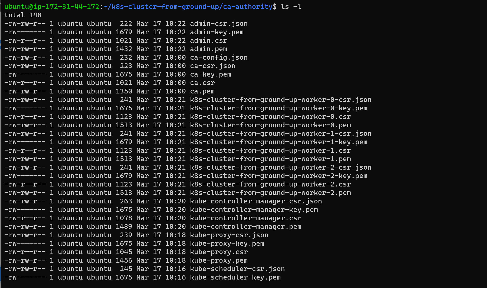

## Step 4 – Distributing the Client and Server Certificates

Now it is time to start sending all the client and server certificates to their respective instances.

Let us begin with the worker nodes:

Copy these files securely to the worker nodes using scp utility

Root CA certificate – ca.pem
X509 Certificate for each worker node
Private Key of the certificate for each worker node

```bash
for i in 0 1 2; do
  instance="${NAME}-worker-${i}"
  external_ip=$(aws ec2 describe-instances \
    --filters "Name=tag:Name,Values=${instance}" \
    --output text --query 'Reservations[].Instances[].PublicIpAddress')
  scp -i ../ssh/${NAME}.id_rsa \
    ca.pem ${instance}-key.pem ${instance}.pem ubuntu@${external_ip}:~/; \
done
```


Master or Controller node: – Note that only the api-server related files will be sent over to the master nodes.

```bash
for i in 0 1 2; do
instance="${NAME}-master-${i}" \
  external_ip=$(aws ec2 describe-instances \
    --filters "Name=tag:Name,Values=${instance}" \
    --output text --query 'Reservations[].Instances[].PublicIpAddress')
  scp -i ../ssh/${NAME}.id_rsa \
    ca.pem ca-key.pem service-account-key.pem service-account.pem \
    master-kubernetes.pem master-kubernetes-key.pem ubuntu@${external_ip}:~/;
done
```
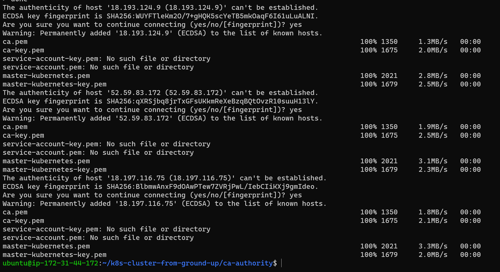

The kube-proxy, kube-controller-manager, kube-scheduler, and kubelet client certificates will be used to generate client authentication configuration files later.

## STEP 5 USE `KUBECTL` TO GENERATE KUBERNETES CONFIGURATION FILES FOR AUTHENTICATION

All the work you are doing right now is ensuring that you do not face any difficulties by the time the Kubernetes cluster is up and running. In this step, you will create some files known as kubeconfig, which enables Kubernetes clients to locate and authenticate to the Kubernetes API Servers.

Now, let's generate kubeconfig files for the kubelet, controller manager, kube-proxy, and scheduler clients and then the admin user.

First, let us create a few environment variables for reuse by multiple commands.

```bash
KUBERNETES_API_SERVER_ADDRESS=$(aws elbv2 describe-load-balancers --load-balancer-arns ${LOAD_BALANCER_ARN} --output text --query 'LoadBalancers[].DNSName')
```

***Generate the kubelet kubeconfig file***

```bash
for i in 0 1 2; do

instance="${NAME}-worker-${i}"
instance_hostname="ip-172-31-0-2${i}"

 # Set the kubernetes cluster in the kubeconfig file
  kubectl config set-cluster ${NAME} \
    --certificate-authority=ca.pem \
    --embed-certs=true \
    --server=https://$KUBERNETES_API_SERVER_ADDRESS:6443 \
    --kubeconfig=${instance}.kubeconfig

# Set the cluster credentials in the kubeconfig file
  kubectl config set-credentials system:node:${instance_hostname} \
    --client-certificate=${instance}.pem \
    --client-key=${instance}-key.pem \
    --embed-certs=true \
    --kubeconfig=${instance}.kubeconfig

# Set the context in the kubeconfig file
  kubectl config set-context default \
    --cluster=${NAME} \
    --user=system:node:${instance_hostname} \
    --kubeconfig=${instance}.kubeconfig

  kubectl config use-context default --kubeconfig=${instance}.kubeconfig
done
```
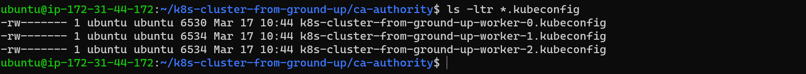


```bash
# 2. Generate the kube-proxy kubeconfig

{
  kubectl config set-cluster ${NAME} \
    --certificate-authority=ca.pem \
    --embed-certs=true \
    --server=https://${KUBERNETES_API_SERVER_ADDRESS}:6443 \
    --kubeconfig=kube-proxy.kubeconfig

  kubectl config set-credentials system:kube-proxy \
    --client-certificate=kube-proxy.pem \
    --client-key=kube-proxy-key.pem \
    --embed-certs=true \
    --kubeconfig=kube-proxy.kubeconfig

  kubectl config set-context default \
    --cluster=${NAME} \
    --user=system:kube-proxy \
    --kubeconfig=kube-proxy.kubeconfig

  kubectl config use-context default --kubeconfig=kube-proxy.kubeconfig
}
```

```bash
# 3. Generate the Kube-Controller-Manager kubeconfig
Notice that the --server is set to use 127.0.0.1. This is because, this component runs on the API-Server so there is no point routing through the Load Balancer.

{
  kubectl config set-cluster ${NAME} \
    --certificate-authority=ca.pem \
    --embed-certs=true \
    --server=https://127.0.0.1:6443 \
    --kubeconfig=kube-controller-manager.kubeconfig

  kubectl config set-credentials system:kube-controller-manager \
    --client-certificate=kube-controller-manager.pem \
    --client-key=kube-controller-manager-key.pem \
    --embed-certs=true \
    --kubeconfig=kube-controller-manager.kubeconfig

  kubectl config set-context default \
    --cluster=${NAME} \
    --user=system:kube-controller-manager \
    --kubeconfig=kube-controller-manager.kubeconfig

  kubectl config use-context default --kubeconfig=kube-controller-manager.kubeconfig
}
```

```bash
#. 4 Generating the Kube-Scheduler Kubeconfig

{
  kubectl config set-cluster ${NAME} \
    --certificate-authority=ca.pem \
    --embed-certs=true \
    --server=https://127.0.0.1:6443 \
    --kubeconfig=kube-scheduler.kubeconfig

  kubectl config set-credentials system:kube-scheduler \
    --client-certificate=kube-scheduler.pem \
    --client-key=kube-scheduler-key.pem \
    --embed-certs=true \
    --kubeconfig=kube-scheduler.kubeconfig

  kubectl config set-context default \
    --cluster=${NAME} \
    --user=system:kube-scheduler \
    --kubeconfig=kube-scheduler.kubeconfig

  kubectl config use-context default --kubeconfig=kube-scheduler.kubeconfig
}
```

```bash
# 5. Finally, generate the kubeconfig file for the admin user

{
  kubectl config set-cluster ${NAME} \
    --certificate-authority=ca.pem \
    --embed-certs=true \
    --server=https://${KUBERNETES_API_SERVER_ADDRESS}:6443 \
    --kubeconfig=admin.kubeconfig

  kubectl config set-credentials admin \
    --client-certificate=admin.pem \
    --client-key=admin-key.pem \
    --embed-certs=true \
    --kubeconfig=admin.kubeconfig

  kubectl config set-context default \
    --cluster=${NAME} \
    --user=admin \
    --kubeconfig=admin.kubeconfig

  kubectl config use-context default --kubeconfig=admin.kubeconfig
}
```

Copy the config files for kublet and kube-proxy to the worker nodes.

```bash
for i in 0 1 2; do
   instance="${NAME}-worker-${i}"
   external_ip=$(aws ec2 describe-instances \
     --filters "Name=tag:Name,Values=${instance}" \
     --output text --query 'Reservations[].Instances[].PublicIpAddress')
    scp -i ../ssh/${NAME}.id_rsa \
    ${instance}.kubeconfig kube-proxy.kubeconfig ubuntu@${external_ip}:~/
done
```


Copy the appropriate kube-controller-manager and kube-scheduler kubeconfig files to each master instance

```bash
for i in 0 1 2; do
instance="${NAME}-master-${i}" \
  external_ip=$(aws ec2 describe-instances \
    --filters "Name=tag:Name,Values=${instance}" \
    --output text --query 'Reservations[].Instances[].PublicIpAddress')
  scp -i ../ssh/${NAME}.id_rsa \
  kube-scheduler.kubeconfig kube-controller-manager.kubeconfig ubuntu@${external_ip}:~/;
done
```
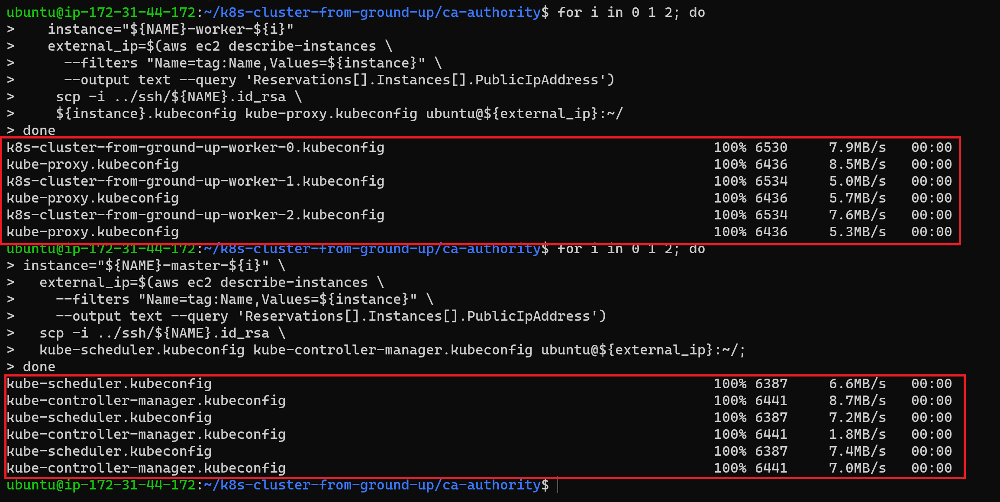

## Step 6 Prepare the etcd database for encryption at rest.

Since the etcd is not encryted at rest, we need to mitigate it,

```bash
# Generate the encryption key and encode it using base64
ETCD_ENCRYPTION_KEY=$(head -c 32 /dev/urandom | base64)
```
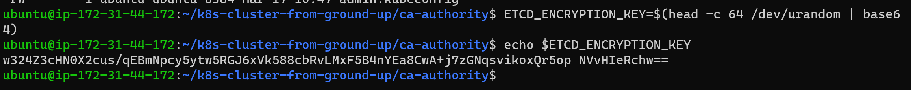

***Create an encryption-config.yaml file as documented officially by kubernetes***

```bash
cat > encryption-config.yaml <<EOF
kind: EncryptionConfig
apiVersion: v1
resources:
  - resources:
      - secrets
    providers:
      - aescbc:
          keys:
            - name: key1
              secret: ${ENCRYPTION_KEY}
      - identity: {}
EOF

```

Send the encryption file to the Master nodes using scp and a for loop

```bash
for i in 0 1 2; do
instance="${NAME}-master-${i}" \
  external_ip=$(aws ec2 describe-instances \
    --filters "Name=tag:Name,Values=${instance}" \
    --output text --query 'Reservations[].Instances[].PublicIpAddress')
  scp -i ../ssh/${NAME}.id_rsa \
  encryption-config.yaml ubuntu@${external_ip}:~/;
done
```


### Bootstrap etcd cluster


SSH into the master controller nodes with tmux

```bash

#Master-1
master_1_ip=$(aws ec2 describe-instances \
--filters "Name=tag:Name,Values=${NAME}-master-0" \
--output text --query 'Reservations[].Instances[].PublicIpAddress')
ssh -i k8s-cluster-from-ground-up.id_rsa ubuntu@${master_1_ip}

#Master-2
master_2_ip=$(aws ec2 describe-instances \
--filters "Name=tag:Name,Values=${NAME}-master-1" \
--output text --query 'Reservations[].Instances[].PublicIpAddress')
ssh -i k8s-cluster-from-ground-up.id_rsa ubuntu@${master_2_ip}

# Master-3
master_3_ip=$(aws ec2 describe-instances \
--filters "Name=tag:Name,Values=${NAME}-master-2" \
--output text --query 'Reservations[].Instances[].PublicIpAddress')
ssh -i k8s-cluster-from-ground-up.id_rsa ubuntu@${master_3_ip}
```


```bash
# Download and install etcd

 wget -q --show-progress --https-only --timestamping \
  "https://github.com/etcd-io/etcd/releases/download/v3.4.15/etcd-v3.4.15-linux-amd64.tar.gz"

# Extract and install the etcd server and the etcdctl command line utility
{
tar -xvf etcd-v3.4.15-linux-amd64.tar.gz
sudo mv etcd-v3.4.15-linux-amd64/etcd* /usr/local/bin/
}

# Configure the etcd server
{
  sudo mkdir -p /etc/etcd /var/lib/etcd
  sudo chmod 700 /var/lib/etcd
  sudo cp ca.pem master-kubernetes-key.pem master-kubernetes.pem /etc/etcd/
}
```

The instance internal IP address will be used to serve client requests and communicate with etcd cluster peers. Retrieve the internal IP address for the current compute instance

```bash
export INTERNAL_IP=$(curl -s http://169.254.169.254/latest/meta-data/local-ipv4)
```

Each etcd member must have a unique name within an etcd cluster. Set the etcd name to node Private IP address so it will uniquely identify the machine

```bash
ETCD_NAME=$(curl -s http://169.254.169.254/latest/user-data/ \
  | tr "|" "\n" | grep "^name" | cut -d"=" -f2)

echo ${ETCD_NAME}
```

Create the etcd.service systemd unit file

```bash
cat <<EOF | sudo tee /etc/systemd/system/etcd.service
[Unit]
Description=etcd
Documentation=https://github.com/coreos

[Service]
Type=notify
ExecStart=/usr/local/bin/etcd \\
  --name ${ETCD_NAME} \\
  --trusted-ca-file=/etc/etcd/ca.pem \\
  --peer-trusted-ca-file=/etc/etcd/ca.pem \\
  --peer-client-cert-auth \\
  --client-cert-auth \\
  --listen-peer-urls https://${INTERNAL_IP}:2380 \\
  --listen-client-urls https://${INTERNAL_IP}:2379,https://127.0.0.1:2379 \\
  --advertise-client-urls https://${INTERNAL_IP}:2379 \\
  --initial-cluster-token etcd-cluster-0 \\
  --initial-cluster master-0=https://172.31.0.10:2380,master-1=https://172.31.0.11:2380,master-2=https://172.31.0.12:2380 \\
  --cert-file=/etc/etcd/master-kubernetes.pem \\
  --key-file=/etc/etcd/master-kubernetes-key.pem \\
  --peer-cert-file=/etc/etcd/master-kubernetes.pem \\
  --peer-key-file=/etc/etcd/master-kubernetes-key.pem \\
  --initial-advertise-peer-urls https://${INTERNAL_IP}:2380 \\
  --initial-cluster-state new \\
  --data-dir=/var/lib/etcd
Restart=on-failure
RestartSec=5

[Install]
WantedBy=multi-user.target
EOF
```

Start and enable the etcd Server

```bash
{
sudo systemctl daemon-reload
sudo systemctl enable etcd
sudo systemctl start etcd
}
```

Verify the etcd installation

```bash
sudo ETCDCTL_API=3 etcdctl member list \
  --endpoints=https://127.0.0.1:2379 \
  --cacert=/etc/etcd/ca.pem \
  --cert=/etc/etcd/master-kubernetes.pem \
  --key=/etc/etcd/master-kubernetes-key.pem
```

check staus

```bash
systemctl status etcd
```

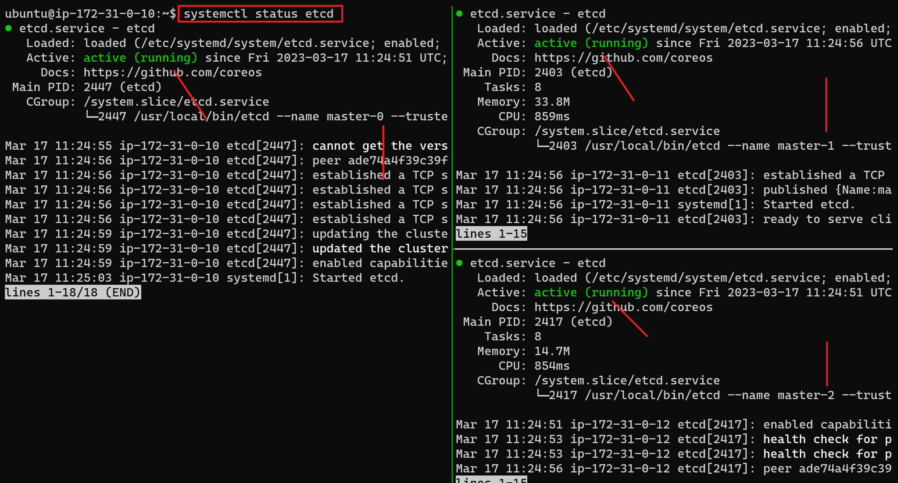

## BOOTSTRAP THE CONTROL PLANE

Create the Kubernetes configuration directory:

```bash
sudo mkdir -p /etc/kubernetes/config
```
Download the official Kubernetes release binaries:

```bash
wget -q --show-progress --https-only --timestamping \
"https://storage.googleapis.com/kubernetes-release/release/v1.21.0/bin/linux/amd64/kube-apiserver" \
"https://storage.googleapis.com/kubernetes-release/release/v1.21.0/bin/linux/amd64/kube-controller-manager" \
"https://storage.googleapis.com/kubernetes-release/release/v1.21.0/bin/linux/amd64/kube-scheduler" \
"https://storage.googleapis.com/kubernetes-release/release/v1.21.0/bin/linux/amd64/kubectl"
```

Install the Kubernetes binaries:
```bash
{
chmod +x kube-apiserver kube-controller-manager kube-scheduler kubectl
sudo mv kube-apiserver kube-controller-manager kube-scheduler kubectl /usr/local/bin/
}
```

Configure the Kubernetes API Server:

```bash
{
sudo mkdir -p /var/lib/kubernetes/

sudo mv ca.pem ca-key.pem master-kubernetes-key.pem master-kubernetes.pem \
service-account-key.pem service-account.pem \
encryption-config.yaml /var/lib/kubernetes/
}
```
The instance internal IP address will be used to advertise the API Server to members of the cluster. Retrieve the internal IP address for the current compute instance:

```bash
export INTERNAL_IP=$(curl -s http://169.254.169.254/latest/meta-data/local-ipv4)
```

Create the kube-apiserver.service systemd unit file

```bash
cat <<EOF | sudo tee /etc/systemd/system/kube-apiserver.service
[Unit]
Description=Kubernetes API Server
Documentation=https://github.com/kubernetes/kubernetes

[Service]
ExecStart=/usr/local/bin/kube-apiserver \\
  --advertise-address=${INTERNAL_IP} \\
  --allow-privileged=true \\
  --apiserver-count=3 \\
  --audit-log-maxage=30 \\
  --audit-log-maxbackup=3 \\
  --audit-log-maxsize=100 \\
  --audit-log-path=/var/log/audit.log \\
  --authorization-mode=Node,RBAC \\
  --bind-address=0.0.0.0 \\
  --client-ca-file=/var/lib/kubernetes/ca.pem \\
  --enable-admission-plugins=NamespaceLifecycle,NodeRestriction,LimitRanger,ServiceAccount,DefaultStorageClass,ResourceQuota \\
  --etcd-cafile=/var/lib/kubernetes/ca.pem \\
  --etcd-certfile=/var/lib/kubernetes/master-kubernetes.pem \\
  --etcd-keyfile=/var/lib/kubernetes/master-kubernetes-key.pem\\
  --etcd-servers=https://172.33.0.10:2379,https://172.33.0.11:2379,https://172.33.0.12:2379 \\
  --event-ttl=1h \\
  --encryption-provider-config=/var/lib/kubernetes/encryption-config.yaml \\
  --kubelet-certificate-authority=/var/lib/kubernetes/ca.pem \\
  --kubelet-client-certificate=/var/lib/kubernetes/master-kubernetes.pem \\
  --kubelet-client-key=/var/lib/kubernetes/master-kubernetes-key.pem \\
  --runtime-config='api/all=true' \\
  --service-account-key-file=/var/lib/kubernetes/service-account.pem \\
  --service-account-signing-key-file=/var/lib/kubernetes/service-account-key.pem \\
  --service-account-issuer=https://${INTERNAL_IP}:6443 \\
  --service-cluster-ip-range=172.32.0.0/24 \\
  --service-node-port-range=30000-32767 \\
  --tls-cert-file=/var/lib/kubernetes/master-kubernetes.pem \\
  --tls-private-key-file=/var/lib/kubernetes/master-kubernetes-key.pem \\
  --v=2
Restart=on-failure
RestartSec=5

[Install]
WantedBy=multi-user.target
EOF
```
Configure the Kubernetes Controller Manager:

```bash
sudo mv kube-controller-manager.kubeconfig /var/lib/kubernetes/
```
Export some variables to retrieve the *vpc_cidr*. This will be required for the *bind-address* flag

```bash
export AWS_METADATA="http://169.254.169.254/latest/meta-data"
export EC2_MAC_ADDRESS=$(curl -s $AWS_METADATA/network/interfaces/macs/ | head -n1 | tr -d '/')
export VPC_CIDR=$(curl -s $AWS_METADATA/network/interfaces/macs/$EC2_MAC_ADDRESS/vpc-ipv4-cidr-block/)
export NAME=k8s-cluster-from-ground-up
```

Create the kube-controller-manager.service systemd unit file
```bash
cat <<EOF | sudo tee /etc/systemd/system/kube-controller-manager.service
[Unit]
Description=Kubernetes Controller Manager
Documentation=https://github.com/kubernetes/kubernetes

[Service]
ExecStart=/usr/local/bin/kube-controller-manager \\
  --bind-address=0.0.0.0 \\
  --cluster-cidr=${VPC_CIDR} \\
  --cluster-name=${NAME} \\
  --cluster-signing-cert-file=/var/lib/kubernetes/ca.pem \\
  --cluster-signing-key-file=/var/lib/kubernetes/ca-key.pem \\
  --kubeconfig=/var/lib/kubernetes/kube-controller-manager.kubeconfig \\
  --authentication-kubeconfig=/var/lib/kubernetes/kube-controller-manager.kubeconfig \\
  --authorization-kubeconfig=/var/lib/kubernetes/kube-controller-manager.kubeconfig \\
  --leader-elect=true \\
  --root-ca-file=/var/lib/kubernetes/ca.pem \\
  --service-account-private-key-file=/var/lib/kubernetes/service-account-key.pem \\
  --service-cluster-ip-range=172.32.0.0/24 \\
  --use-service-account-credentials=true \\
  --v=2
Restart=on-failure
RestartSec=5

[Install]
WantedBy=multi-user.target
EOF
```

Configure the Kubernetes Scheduler

```bash
# Move the kube-scheduler kubeconfig into place
sudo mv kube-scheduler.kubeconfig /var/lib/kubernetes/
sudo mkdir -p /etc/kubernetes/config
```

Create the kube-scheduler.yaml configuration file

```bash
cat <<EOF | sudo tee /etc/kubernetes/config/kube-scheduler.yaml
apiVersion: kubescheduler.config.k8s.io/v1beta1
kind: KubeSchedulerConfiguration
clientConnection:
  kubeconfig: "/var/lib/kubernetes/kube-scheduler.kubeconfig"
leaderElection:
  leaderElect: true
EO
```

Create the kube-scheduler.service systemd unit file

```bash
cat <<EOF | sudo tee /etc/systemd/system/kube-scheduler.service
[Unit]
Description=Kubernetes Scheduler
Documentation=https://github.com/kubernetes/kubernetes

[Service]
ExecStart=/usr/local/bin/kube-scheduler \\
  --config=/etc/kubernetes/config/kube-scheduler.yaml \\
  --v=2
Restart=on-failure
RestartSec=5

[Install]
WantedBy=multi-user.target
EOF
```

Start the Controller Services

```bash
{
sudo systemctl daemon-reload
sudo systemctl enable kube-apiserver kube-controller-manager kube-scheduler
sudo systemctl start kube-apiserver kube-controller-manager kube-scheduler
}
```

Check the status of the services. Start with the kube-scheduler and kube-controller-manager. It may take up to 20 seconds for kube-apiserver to be fully loaded.

```bash
{
sudo systemctl status kube-apiserver
sudo systemctl status kube-controller-manager
sudo systemctl status kube-scheduler
}
```

kube-apiserver
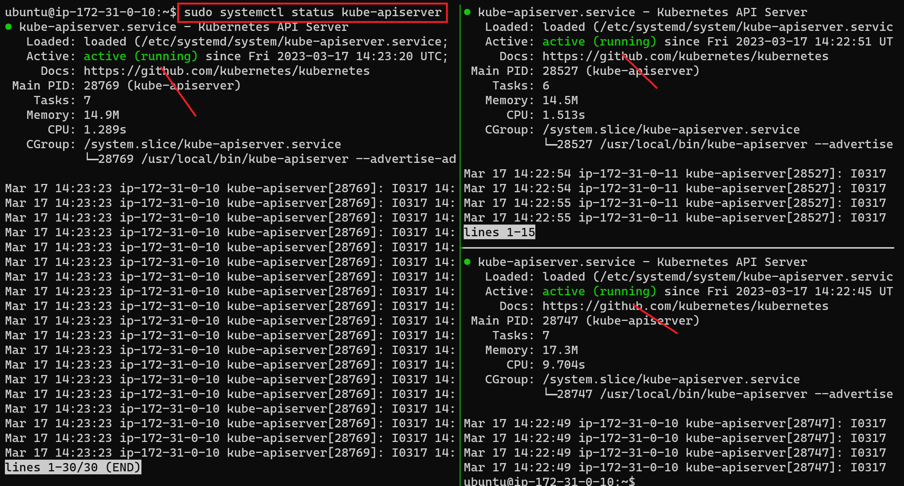

kube-controller-manager
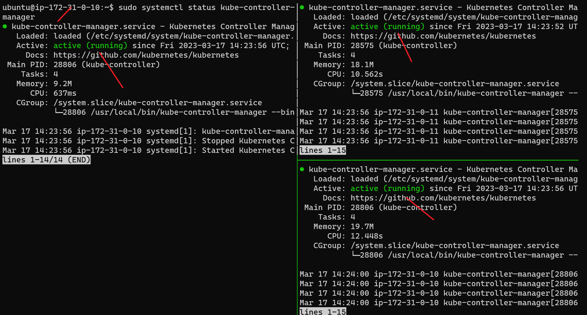

kube-scheduler


Test that Everything is working fine

```bash
# To get the cluster details run
kubectl cluster-info  --kubeconfig admin.kubeconfig

# To get the current namespace
kubectl get namespaces --kubeconfig admin.kubeconfig
```


To get the status of each component

```bash
kubectl get componentstatuses --kubeconfig admin.kubeconfig
```
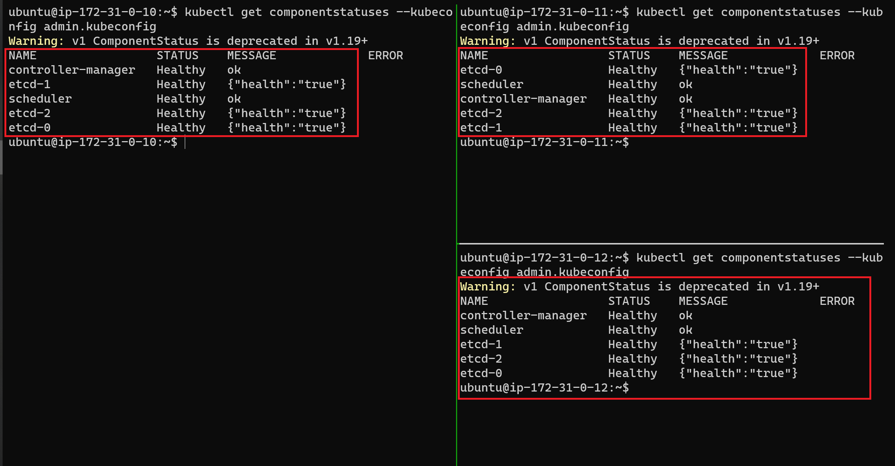

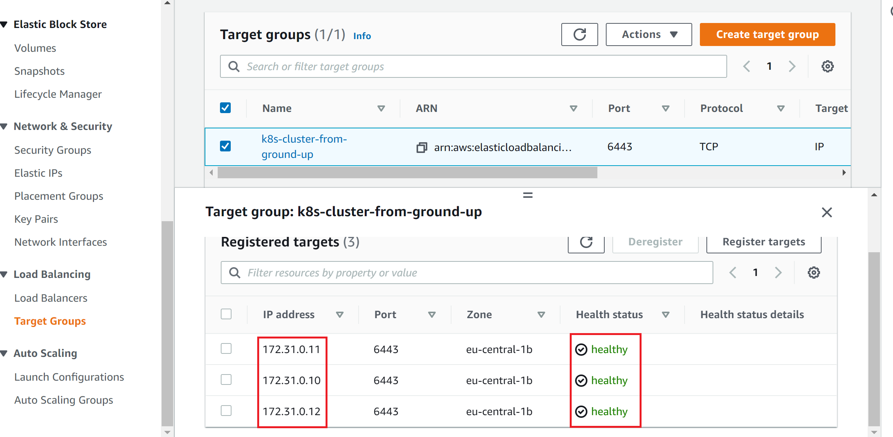

### On one of the controller nodes, configure Role Based Access Control (RBAC) so that the api-server has necessary authorization for for the kubelet.

```bash
# Create the ClusterRole

cat <<EOF | kubectl apply --kubeconfig admin.kubeconfig -f -
apiVersion: rbac.authorization.k8s.io/v1
kind: ClusterRole
metadata:
  annotations:
    rbac.authorization.kubernetes.io/autoupdate: "true"
  labels:
    kubernetes.io/bootstrapping: rbac-defaults
  name: system:kube-apiserver-to-kubelet
rules:
  - apiGroups:
      - ""
    resources:
      - nodes/proxy
      - nodes/stats
      - nodes/log
      - nodes/spec
      - nodes/metrics
    verbs:
      - "*"
EOF
```
Create the ClusterRoleBinding to bind the kubernetes user with the role created above

```bash
cat <<EOF | kubectl --kubeconfig admin.kubeconfig  apply -f -
apiVersion: rbac.authorization.k8s.io/v1
kind: ClusterRoleBinding
metadata:
  name: system:kube-apiserver
  namespace: ""
roleRef:
  apiGroup: rbac.authorization.k8s.io
  kind: ClusterRole
  name: system:kube-apiserver-to-kubelet
subjects:
  - apiGroup: rbac.authorization.k8s.io
    kind: User
    name: kubernetes
EOF
```

## Configuring the Kubernetes Worker nodes

Before we begin to bootstrap the worker nodes, it is important to understand that the K8s API Server authenticates to the kubelet as the kubernetes user using the same kubernetes.pem certificate.

We need to configure Role Based Access (RBAC) for Kubelet Authorization

Configure RBAC permissions to allow the Kubernetes API Server to access the Kubelet API on each worker node. Access to the Kubelet API is required for retrieving metrics, logs, and executing commands in pods

```bash
# Run the below script on the Controller node

cat <<EOF | kubectl apply --kubeconfig admin.kubeconfig -f -
apiVersion: rbac.authorization.k8s.io/v1
kind: ClusterRole
metadata:
  annotations:
    rbac.authorization.kubernetes.io/autoupdate: "true"
  labels:
    kubernetes.io/bootstrapping: rbac-defaults
  name: system:kube-apiserver-to-kubelet
rules:
  - apiGroups:
      - ""
    resources:
      - nodes/proxy
      - nodes/stats
      - nodes/log
      - nodes/spec
      - nodes/metrics
    verbs:
      - "*"
EOF
```

Next, bind the system:kube-apiserver-to-kubelet ClusterRole to the kubernetes user so that API server can authenticate successfully to the kubelets on the worker nodes.

```bash
cat <<EOF | kubectl apply --kubeconfig admin.kubeconfig -f -
apiVersion: rbac.authorization.k8s.io/v1
kind: ClusterRoleBinding
metadata:
  name: system:kube-apiserver
  namespace: ""
roleRef:
  apiGroup: rbac.authorization.k8s.io
  kind: ClusterRole
  name: system:kube-apiserver-to-kubelet
subjects:
  - apiGroup: rbac.authorization.k8s.io
    kind: User
    name: kubernetes
EOF
```

## Bootstraping components on the worker nodes

The following components will be installed on each node:

- kubelet
- kube-proxy
- Containerd or Docker
- Networking plugins

SSH into the worker nodes

```bash 

# Worker Node 1
worker_1_ip=$(aws ec2 describe-instances \
--filters "Name=tag:Name,Values=${NAME}-worker-0" \
--output text --query 'Reservations[].Instances[].PublicIpAddress')
ssh -i k8s-cluster-from-ground-up.id_rsa ubuntu@${worker_1_ip}

# Worker Node 2
worker_2_ip=$(aws ec2 describe-instances \
--filters "Name=tag:Name,Values=${NAME}-worker-1" \
--output text --query 'Reservations[].Instances[].PublicIpAddress')
ssh -i k8s-cluster-from-ground-up.id_rsa ubuntu@${worker_2_ip}

# Worker Node 3
worker_3_ip=$(aws ec2 describe-instances \
--filters "Name=tag:Name,Values=${NAME}-worker-2" \
--output text --query 'Reservations[].Instances[].PublicIpAddress')
ssh -i k8s-cluster-from-ground-up.id_rsa ubuntu@${worker_3_ip}

```

Install OS dependencies

```bash
{
  sudo apt-get update
  sudo apt-get -y install socat conntrack ipset
}

# Test if swap is already enabled on the host:
sudo swapon --show

# If there is no output, then you are good to go. Otherwise, run below command to turn it off
sudo swapoff -a
```

Download and install a container runtime - *Containerd*

```bash
# Download binaries for runc, cri-ctl, and containerd
wget https://github.com/opencontainers/runc/releases/download/v1.0.0-rc93/runc.amd64 \
  https://github.com/kubernetes-sigs/cri-tools/releases/download/v1.21.0/crictl-v1.21.0-linux-amd64.tar.gz \
  https://github.com/containerd/containerd/releases/download/v1.4.4/containerd-1.4.4-linux-amd64.tar.g

# Configure containerd
{
  mkdir containerd
  tar -xvf crictl-v1.21.0-linux-amd64.tar.gz
  tar -xvf containerd-1.4.4-linux-amd64.tar.gz -C containerd
  sudo mv runc.amd64 runc
  chmod +x  crictl runc  
  sudo mv crictl runc /usr/local/bin/
  sudo mv containerd/bin/* /bin/
}
```

```bash
sudo mkdir -p /etc/containerd/
```

```bash
cat << EOF | sudo tee /etc/containerd/config.toml
[plugins]
  [plugins.cri.containerd]
    snapshotter = "overlayfs"
    [plugins.cri.containerd.default_runtime]
      runtime_type = "io.containerd.runtime.v1.linux"
      runtime_engine = "/usr/local/bin/runc"
      runtime_root = ""
EOF
```

Create the containerd.service systemd unit file

```bash
cat <<EOF | sudo tee /etc/systemd/system/containerd.service
[Unit]
Description=containerd container runtime
Documentation=https://containerd.io
After=network.target

[Service]
ExecStartPre=/sbin/modprobe overlay
ExecStart=/bin/containerd
Restart=always
RestartSec=5
Delegate=yes
KillMode=process
OOMScoreAdjust=-999
LimitNOFILE=1048576
LimitNPROC=infinity
LimitCORE=infinity

[Install]
WantedBy=multi-user.target
EOF
```

Create directories for to configure kubelet, kube-proxy, cni, and a directory to keep the kubernetes root ca file

```bash
sudo mkdir -p \
  /var/lib/kubelet \
  /var/lib/kube-proxy \
  /etc/cni/net.d \
  /opt/cni/bin \
  /var/lib/kubernetes \
  /var/run/kubernetes
```

Download and Install CNI (Container Network Interface)

```bash
wget -q --show-progress --https-only --timestamping \
  https://github.com/containernetworking/plugins/releases/download/v0.9.1/cni-plugins-linux-amd64-v0.9.1.tgz

# Install CNI into /opt/cni/bin/
sudo tar -xvf cni-plugins-linux-amd64-v0.9.1.tgz -C /opt/cni/bin/
```


Download binaries for kubectl, kube-proxy, and kubelet

```bash
wget -q --show-progress --https-only --timestamping \
  https://storage.googleapis.com/kubernetes-release/release/v1.21.0/bin/linux/amd64/kubectl \
  https://storage.googleapis.com/kubernetes-release/release/v1.21.0/bin/linux/amd64/kube-proxy \
  https://storage.googleapis.com/kubernetes-release/release/v1.21.0/bin/linux/amd64/kubelet
```

Install the downloaded binaries

```bash
{
  chmod +x  kubectl kube-proxy kubelet  
  sudo mv  kubectl kube-proxy kubelet /usr/local/bin/
}
```

## Configure the worker nodes components