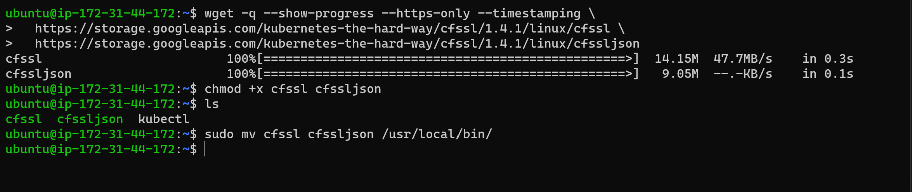

# K8s From-Ground-Up

For a better understanding of each aspect of spinning up a Kubernetes cluster, we will do it without any automated helpers. You will install each and every component manually from scratch and learn how to make them work together.

## Let us begin!!! 

**Step One: INSTALL CLIENT TOOLS BEFORE BOOTSTRAPPING THE CLUSTER.**

- Aws CLI - is a unified tool to manage your AWS services.
- Kubectl - this command line utility will be your main control tool to manage your K8s cluster.
- cfssl - an open source toolkit for everything TLS/SSL from Cloudflare
- cfssljson -  a program, which takes the JSON output from the cfssl and writes certificates, keys, CSRs, and bundles to disk.

***Installing kubectl***

```bash
#Download the binary
wget https://storage.googleapis.com/kubernetes-release/release/v1.21.0/bin/linux/amd64/kubectl

# Make it executable
chmod +x kubectl

# Move to the Bin directory
sudo mv kubectl /usr/local/bin/

# Verify that kubectl version 1.21.0 or higher is installed:
kubectl version --client
```


***Install CFSSL and CFSSLJSON***

***ccfssl*** is an open source tool by Cloudflare used to setup a Public Key Infrastructure (PKI Infrastructure) for generating, signing and bundling TLS certificates. In previous projects you have experienced the use of Letsencrypt for the similar use case. Here, cfssl will be configured as a Certificate Authority which will issue the certificates required to spin up a Kubernetes cluster.

```bash
# Download cfssl
curl -o cfssl https://storage.googleapis.com/kubernetes-the-hard-way/cfssl/1.4.1/darwin/cfssl

# Download cfssljson
curl -o cfssljson https://storage.googleapis.com/kubernetes-the-hard-way/cfssl/1.4.1/darwin/cfssljson

# Make it executable
chmod +x cfssl cfssljson

# Move to the Bin directory
sudo mv cfssl cfssljson /usr/local/bin/
```



***AWS CLOUD RESOURCES FOR KUBERNETES CLUSTER***

Step 1 – Configure Network Infrastructure

```bash
# 1. Create a directory named k8s-cluster-from-ground-up
mkdir k8s-cluster-from-ground-up

# 2. Create a VPC and store the ID as a variable:
VPC_ID=$(aws ec2 create-vpc \
--cidr-block 172.33.0.0/16 \
--output text --query 'Vpc.VpcId'
)

# 3. Tag the VPC so that it is named:
NAME=k8s-cluster-from-ground-up

aws ec2 create-tags \
  --resources ${VPC_ID} \
  --tags Key=Name,Value=${NAME}
```


**Domain Name System – DNS**

DNS resolution is enabled by default but not DNS hostname

```bash

# 4. Enable DNS hostnames:
aws ec2 modify-vpc-attribute \
--vpc-id ${VPC_ID} \
--enable-dns-hostnames '{"Value": true}'

 # 5. Set the required region
 AWS_REGION=eu-central-1
 ```
  
 

***Dynamic Host Configuration Protocol – DHCP***

AWS automatically creates and associates a DHCP option set for your Amazon VPC upon creation and sets two options: domain-name-servers (defaults to AmazonProvidedDNS) and domain-name (defaults to the domain name for your set region). AmazonProvidedDNS is an Amazon Domain Name System (DNS) server, and this option enables DNS for instances to communicate using DNS names.

```bash
# 6. Configure DHCP Options Set
DHCP_OPTION_SET_ID=$(aws ec2 create-dhcp-options \
  --dhcp-configuration \
    "Key=domain-name,Values=$AWS_REGION.compute.internal" \
    "Key=domain-name-servers,Values=AmazonProvidedDNS" \
  --output text --query 'DhcpOptions.DhcpOptionsId')

# 7. Tag the DHCP Option Set
aws ec2 create-tags \
  --resources ${DHCP_OPTION_SET_ID} \
  --tags Key=Name,Value=${NAME}
```

