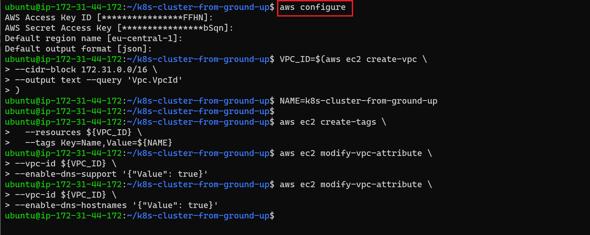
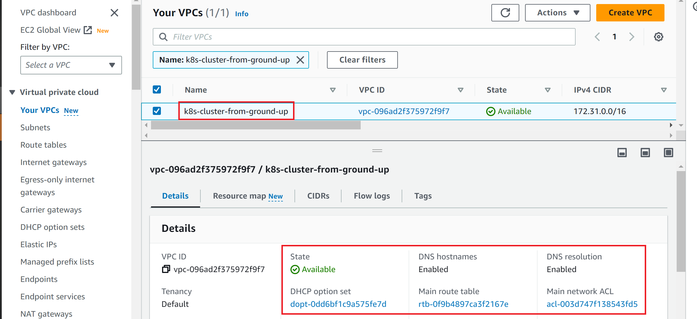
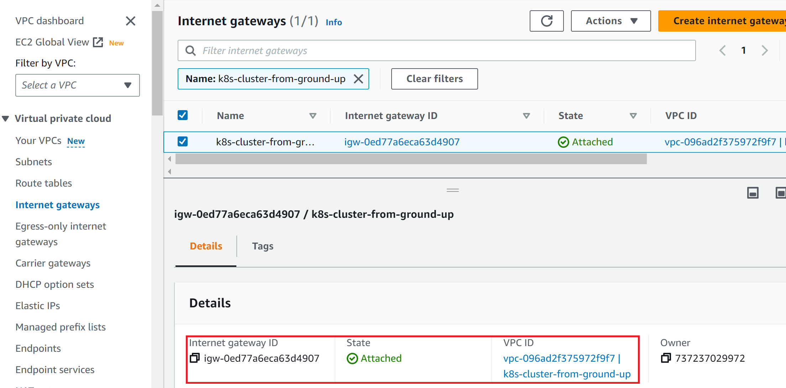
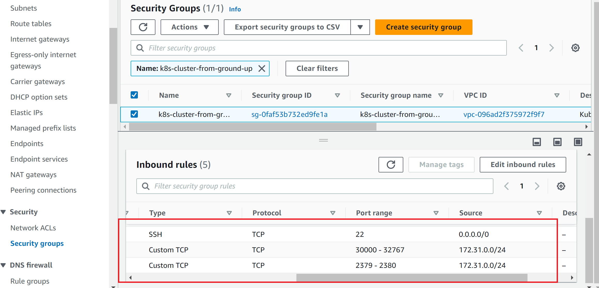
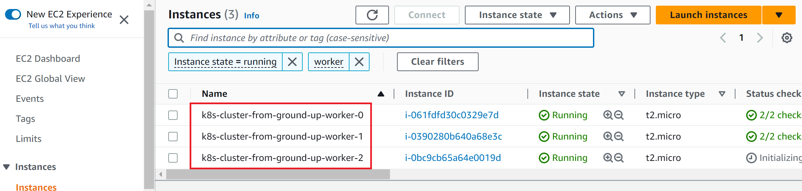

# K8s From-Ground-Up

For a better understanding of each aspect of spinning up a Kubernetes cluster, we will do it without any automated helpers. You will install each and every component manually from scratch and learn how to make them work together.

## Let us begin!!! 

**Step One: INSTALL CLIENT TOOLS BEFORE BOOTSTRAPPING THE CLUSTER.**

- Aws CLI - is a unified tool to manage your AWS services.
- Kubectl - this command line utility will be your main control tool to manage your K8s cluster.
- cfssl - an open source toolkit for everything TLS/SSL from Cloudflare
- cfssljson -  a program, which takes the JSON output from the cfssl and writes certificates, keys, CSRs, and bundles to disk.

***Installing kubectl***

```bash
#Download the binary
wget https://storage.googleapis.com/kubernetes-release/release/v1.21.0/bin/linux/amd64/kubectl

# Make it executable
chmod +x kubectl

# Move to the Bin directory
sudo mv kubectl /usr/local/bin/

# Verify that kubectl version 1.21.0 or higher is installed:
kubectl version --client
```


***Install CFSSL and CFSSLJSON***

***ccfssl*** is an open source tool by Cloudflare used to setup a Public Key Infrastructure (PKI Infrastructure) for generating, signing and bundling TLS certificates. In previous projects you have experienced the use of Letsencrypt for the similar use case. Here, cfssl will be configured as a Certificate Authority which will issue the certificates required to spin up a Kubernetes cluster.

```bash
# Install go for windows
choco install go

# Download cfssl, cfssljson and other bundles
go install github.com/cloudflare/cfssl/cmd/...@latest

```


***AWS CLOUD RESOURCES FOR KUBERNETES CLUSTER***

## Step 1 – Configure Network Infrastructure 

```bash
# 1. Create a directory named k8s-cluster-from-ground-up
mkdir k8s-cluster-from-ground-up

# 2. Create a VPC and store the ID as a variable:
VPC_ID=$(aws ec2 create-vpc \
--cidr-block 172.33.0.0/16 \
--output text --query 'Vpc.VpcId'
)

# 3. Tag the VPC so that it is named:
NAME=k8s-cluster-from-ground-up

aws ec2 create-tags \
  --resources ${VPC_ID} \
  --tags Key=Name,Value=${NAME}
```




**Domain Name System – DNS**

DNS resolution is enabled by default but not DNS hostname

```bash

# 4. Enable DNS hostnames:
aws ec2 modify-vpc-attribute \
--vpc-id ${VPC_ID} \
--enable-dns-hostnames '{"Value": true}'

 # 5. Set the required region
 AWS_REGION=eu-central-1
 ```

 

***Dynamic Host Configuration Protocol – DHCP***

AWS automatically creates and associates a DHCP option set for your Amazon VPC upon creation and sets two options: domain-name-servers (defaults to AmazonProvidedDNS) and domain-name (defaults to the domain name for your set region). AmazonProvidedDNS is an Amazon Domain Name System (DNS) server, and this option enables DNS for instances to communicate using DNS names.

```bash
# 6. Configure DHCP Options Set
DHCP_OPTION_SET_ID=$(aws ec2 create-dhcp-options \
  --dhcp-configuration \
    "Key=domain-name,Values=$AWS_REGION.compute.internal" \
    "Key=domain-name-servers,Values=AmazonProvidedDNS" \
  --output text --query 'DhcpOptions.DhcpOptionsId')

# 7. Tag the DHCP Option Set
aws ec2 create-tags \
  --resources ${DHCP_OPTION_SET_ID} \
  --tags Key=Name,Value=${NAME}

```


```bash
# 8. Associate the DHCP Option set with the VPC:
aws ec2 associate-dhcp-options \
  --dhcp-options-id ${DHCP_OPTION_SET_ID} \
  --vpc-id ${VPC_ID}
  ```


```bash
# 9 Create the Subnet
SUBNET_ID=$(aws ec2 create-subnet \
  --vpc-id ${VPC_ID} \
  --cidr-block 172.33.0.0/24 \
  --output text --query 'Subnet.SubnetId')

# 10. Add tag to Subnet
aws ec2 create-tags \
  --resources ${SUBNET_ID} \
  --tags Key=Name,Value=${NAME}
```



```bash
# 11. Create the Internet Gateway and attach it to the VPC
INTERNET_GATEWAY_ID=$(aws ec2 create-internet-gateway \
  --output text --query 'InternetGateway.InternetGatewayId')

# 12. Tag Internet gateway  
aws ec2 create-tags \
  --resources ${INTERNET_GATEWAY_ID} \
  --tags Key=Name,Value=${NAME}

# 13. Attach Internet Gateway to VPC
aws ec2 attach-internet-gateway \
  --internet-gateway-id ${INTERNET_GATEWAY_ID} \
  --vpc-id ${VPC_ID}
```


```bash
# 14. Create route tables

ROUTE_TABLE_ID=$(aws ec2 create-route-table \
  --vpc-id ${VPC_ID} \
  --output text --query 'RouteTable.RouteTableId')

# 15. Tag the route table

aws ec2 create-tags \
  --resources ${ROUTE_TABLE_ID} \
  --tags Key=Name,Value=${NAME}

# 16. Associate the route table to subnet

aws ec2 associate-route-table \
  --route-table-id ${ROUTE_TABLE_ID} \
  --subnet-id ${SUBNET_ID}

# 17. Create a route to allow external traffic to the Internet through the Internet Gateway

aws ec2 create-route \
  --route-table-id ${ROUTE_TABLE_ID} \
  --destination-cidr-block 0.0.0.0/0 \
  --gateway-id ${INTERNET_GATEWAY_ID}
```




***Configure security groups***

```bash

# 18. Create the security group and store its ID in a variable
SECURITY_GROUP_ID=$(aws ec2 create-security-group \
  --group-name ${NAME} \
  --description "Kubernetes cluster security group" \
  --vpc-id ${VPC_ID} \
  --output text --query 'GroupId')

# Create the NAME tag for the security group
aws ec2 create-tags \
  --resources ${SECURITY_GROUP_ID} \
  --tags Key=Name,Value=${NAME}


# Create Inbound traffic for all communication within the subnet to connect on ports used by the master node(s)
aws ec2 authorize-security-group-ingress \
    --group-id ${SECURITY_GROUP_ID} \
    --ip-permissions IpProtocol=tcp,FromPort=2379,ToPort=2380,IpRanges='[{CidrIp=172.33.0.0/24}]'

# # Create Inbound traffic for all communication within the subnet to connect on ports used by the worker nodes
aws ec2 authorize-security-group-ingress \
    --group-id ${SECURITY_GROUP_ID} \
    --ip-permissions IpProtocol=tcp,FromPort=30000,ToPort=32767,IpRanges='[{CidrIp=172.33.0.0/24}]'

# Create inbound traffic to allow connections to the Kubernetes API Server listening on port 6443
aws ec2 authorize-security-group-ingress \
  --group-id ${SECURITY_GROUP_ID} \
  --protocol tcp \
  --port 6443 \
  --cidr 0.0.0.0/0

# Create Inbound traffic for SSH from anywhere (Do not do this in production. Limit access ONLY to IPs or CIDR that MUST connect)
aws ec2 authorize-security-group-ingress \
  --group-id ${SECURITY_GROUP_ID} \
  --protocol tcp \
  --port 22 \
  --cidr 0.0.0.0/0

# Create ICMP ingress for all types
aws ec2 authorize-security-group-ingress \
  --group-id ${SECURITY_GROUP_ID} \
  --protocol icmp \
  --port -1 \
  --cidr 0.0.0.0/0
```


***Network Load Balancer***

```bash
# 19. Create a network Load balancer

LOAD_BALANCER_ARN=$(aws elbv2 create-load-balancer \
--name ${NAME} \
--subnets ${SUBNET_ID} \
--scheme internet-facing \
--type network \
--output text --query 'LoadBalancers[].LoadBalancerArn')

```


***Tagret Group***

*For now, it will be unhealthy because there are no real targets yet.*

```bash 
# 20. Create a target group:

TARGET_GROUP_ARN=$(aws elbv2 create-target-group \
  --name ${NAME} \
  --protocol TCP \
  --port 6443 \
  --vpc-id ${VPC_ID} \
  --target-type ip \
  --output text --query 'TargetGroups[].TargetGroupArn')

 # .21 Register targets - (Just like above, no real targets. You will just put the IP addresses so that, when the nodes become available, they will be used as targets.)
 aws elbv2 register-targets \
  --target-group-arn ${TARGET_GROUP_ARN} \
  --targets Id=172.33.0.1{0,1,2} 
```


```bash
# 22. Create a listener to listen for requests and forward to the target nodes on TCP port 6443

aws elbv2 create-listener \
--load-balancer-arn ${LOAD_BALANCER_ARN} \
--protocol TCP \
--port 6443 \
--default-actions Type=forward,TargetGroupArn=${TARGET_GROUP_ARN} \
--output text --query 'Listeners[].ListenerArn'
```


```bash
# 23. Get the Kubernetes Public address
KUBERNETES_PUBLIC_ADDRESS=$(aws elbv2 describe-load-balancers \
--load-balancer-arns ${LOAD_BALANCER_ARN} \
--output text --query 'LoadBalancers[].DNSName')
```

## Step 2 – Create Compute Resources

```bash
# Get an image to create EC2 instances
IMAGE_ID=$(aws ec2 describe-images --owners 099720109477 \
  --filters \
  'Name=root-device-type,Values=ebs' \
  'Name=architecture,Values=x86_64' \
  'Name=name,Values=ubuntu/images/hvm-ssd/ubuntu-xenial-16.04-amd64-server-*' \
  | jq -r '.Images|sort_by(.Name)[-1]|.ImageId')


# Create SSH Key-Pair *k8s-cluster-from-ground-up.id_rsa*
mkdir -p ssh

aws ec2 create-key-pair \
  --key-name ${NAME} \
  --output text --query 'KeyMaterial' \
  > ssh/${NAME}.id_rsa
chmod 600 ssh/${NAME}.id_rsa
```

***EC2 Instances for Controle Plane (Master Nodes)***

```bash
# Create 3 Master nodes

for i in 0 1 2; do
  instance_id=$(aws ec2 run-instances \
    --associate-public-ip-address \
    --image-id ${IMAGE_ID} \
    --count 1 \
    --key-name ${NAME} \
    --security-group-ids ${SECURITY_GROUP_ID} \
    --instance-type t2.micro \
    --private-ip-address 172.33.0.1${i} \
    --user-data "name=master-${i}" \
    --subnet-id ${SUBNET_ID} \
    --output text --query 'Instances[].InstanceId')

  aws ec2 modify-instance-attribute \
    --instance-id ${instance_id} \
    --no-source-dest-check

  aws ec2 create-tags \
    --resources ${instance_id} \
    --tags "Key=Name,Value=${NAME}-master-${i}"
done

```



***EC2 Instances for Worker Nodes***

```bash
# Create 3 worker nodes
for i in 0 1 2; do
  instance_id=$(aws ec2 run-instances \
    --associate-public-ip-address \
    --image-id ${IMAGE_ID} \
    --count 1 \
    --key-name ${NAME} \
    --security-group-ids ${SECURITY_GROUP_ID} \
    --instance-type t2.micro \
    --private-ip-address 172.33.0.2${i} \
    --user-data "name=worker-${i}|pod-cidr=172.20.${i}.0/24" \
    --subnet-id ${SUBNET_ID} \
    --output text --query 'Instances[].InstanceId')

  aws ec2 modify-instance-attribute \
    --instance-id ${instance_id} \
    --no-source-dest-check

  aws ec2 create-tags \
    --resources ${instance_id} \
    --tags "Key=Name,Value=${NAME}-worker-${i}"
done
```


## Step 3 Prepare The Self-Signed Certificate Authority And Generate TLS Certificates

The following components running on the ***Master*** node will require TLS certificates.

- kube-controller-manager
- kube-scheduler
- etcd
- kube-apiserver

The following components running on the ***Worker*** nodes will require TLS certificates.

- kubelet
- kube-proxy

***Self-Signed Root Certificate Authority (CA)***

Here, you will provision a CA that will be used to sign additional TLS certificates.

Create a directory and cd into it:

```bash
mkdir ca-authority && cd ca-authority
```
Generate the CA configuration file, Root Certificate, and Private key:

```bash
{

cat > ca-config.json <<EOF
{
  "signing": {
    "default": {
      "expiry": "8760h"
    },
    "profiles": {
      "kubernetes": {
        "usages": ["signing", "key encipherment", "server auth", "client auth"],
        "expiry": "8760h"
      }
    }
  }
}
EOF

cat > ca-csr.json <<EOF
{
  "CN": "Kubernetes",
  "key": {
    "algo": "rsa",
    "size": 2048
  },
  "names": [
    {
      "C": "UK",
      "L": "England",
      "O": "Kubernetes",
      "OU": "DAREY.IO DEVOPS",
      "ST": "London"
    }
  ]
}
EOF

cfssl gencert -initca ca-csr.json | cfssljson -bare ca

}
```


***Generating TLS Certificates For Client and Server***

Now we have a certificate for the Root CA, we can then begin to request more certificates which the different Kubernetes components, i.e. clients and server, will use to have encrypted communication.

Remember, the clients here refer to every other component that will communicate with the api-server. These are:

- kube-controller-manager
- kube-scheduler
- etcd
- kubelet
- kube-proxy
- Kubernetes Admin User

***Let us begin with the Kubernetes API-Server Certificate and Private Key***

The certificate for the Api-server must have IP addresses, DNS names, and a Load Balancer address included. Otherwise, you will have a lot of difficulties connecting to the api-server.

```bash
# Generate the Certificate Signing Request (CSR), Private Key and the Certificate for the Kubernetes Master Nodes.

{
cat > master-kubernetes-csr.json <<EOF
{
  "CN": "kubernetes",
   "hosts": [
   "127.0.0.1",
   "172.33.0.10",
   "172.33.0.11",
   "172.33.0.12",
   "ip-172-33-0-10",
   "ip-172-33-0-11",
   "ip-172-33-0-12",
   "ip-172-33-0-10.${AWS_REGION}.compute.internal",
   "ip-172-33-0-11.${AWS_REGION}.compute.internal",
   "ip-172-33-0-12.${AWS_REGION}.compute.internal",
   "${KUBERNETES_PUBLIC_ADDRESS}",
   "kubernetes",
   "kubernetes.default",
   "kubernetes.default.svc",
   "kubernetes.default.svc.cluster",
   "kubernetes.default.svc.cluster.local"
  ],
  "key": {
    "algo": "rsa",
    "size": 2048
  },
  "names": [
    {
      "C": "UK",
      "L": "England",
      "O": "Kubernetes",
      "OU": "DAREY.IO DEVOPS",
      "ST": "London"
    }
  ]
}
EOF

cfssl gencert \
  -ca=ca.pem \
  -ca-key=ca-key.pem \
  -config=ca-config.json \
  -profile=kubernetes \
  master-kubernetes-csr.json | cfssljson -bare master-kubernetes
}
```


Next, let's creating the other certificates: for the following Kubernetes components:

- Scheduler Client Certificate
- Kube Proxy Client Certificate
- Controller Manager Client Certificate
- Kubelet Client Certificates
- K8s admin user Client Certificate

```bash
# kube-scheduler Client Certificate and Private Key
{

cat > kube-scheduler-csr.json <<EOF
{
  "CN": "system:kube-scheduler",
  "key": {
    "algo": "rsa",
    "size": 2048
  },
  "names": [
    {
      "C": "UK",
      "L": "England",
      "O": "system:kube-scheduler",
      "OU": "DAREY.IO DEVOPS",
      "ST": "London"
    }
  ]
}
EOF

cfssl gencert \
  -ca=ca.pem \
  -ca-key=ca-key.pem \
  -config=ca-config.json \
  -profile=kubernetes \
  kube-scheduler-csr.json | cfssljson -bare kube-scheduler

}
```

```bash
# kube-proxy Client Certificate and Private Key

{

cat > kube-proxy-csr.json <<EOF
{
  "CN": "system:kube-proxy",
  "key": {
    "algo": "rsa",
    "size": 2048
  },
  "names": [
    {
      "C": "UK",
      "L": "England",
      "O": "system:node-proxier",
      "OU": "DAREY.IO DEVOPS",
      "ST": "London"
    }
  ]
}
EOF

cfssl gencert \
  -ca=ca.pem \
  -ca-key=ca-key.pem \
  -config=ca-config.json \
  -profile=kubernetes \
  kube-proxy-csr.json | cfssljson -bare kube-proxy

}
```

```bash
# kube-controller-manager Client Certificate and Private Key

{
cat > kube-controller-manager-csr.json <<EOF
{
  "CN": "system:kube-controller-manager",
  "key": {
    "algo": "rsa",
    "size": 2048
  },
  "names": [
    {
      "C": "UK",
      "L": "England",
      "O": "system:kube-controller-manager",
      "OU": "DAREY.IO DEVOPS",
      "ST": "London"
    }
  ]
}
EOF

cfssl gencert \
  -ca=ca.pem \
  -ca-key=ca-key.pem \
  -config=ca-config.json \
  -profile=kubernetes \
  kube-controller-manager-csr.json | cfssljson -bare kube-controller-manager

}
```

***kubelet Client Certificate and Private Key***

Similar to how you configured the api-server's certificate, Kubernetes requires that the hostname of each worker node is included in the client certificate.

Also, Kubernetes uses a special-purpose authorization mode called Node Authorizer, that specifically authorizes API requests made by kubelet services. In order to be authorized by the Node Authorizer, kubelets must use a credential that identifies them as being in the system:nodes group, with a username of `system:node:<nodeName>`. Notice the "CN": "system:node:${instance_hostname}", in the below code.

```bash
for i in 0 1 2; do
  instance="${NAME}-worker-${i}"
  instance_hostname="ip-172-33-0-2${i}"
  cat > ${instance}-csr.json <<EOF
{
  "CN": "system:node:${instance_hostname}",
  "key": {
    "algo": "rsa",
    "size": 2048
  },
  "names": [
    {
      "C": "UK",
      "L": "England",
      "O": "system:nodes",
      "OU": "DAREY.IO DEVOPS",
      "ST": "London"
    }
  ]
}
EOF

  external_ip=$(aws ec2 describe-instances \
    --filters "Name=tag:Name,Values=${instance}" \
    --output text --query 'Reservations[].Instances[].PublicIpAddress')

  internal_ip=$(aws ec2 describe-instances \
    --filters "Name=tag:Name,Values=${instance}" \
    --output text --query 'Reservations[].Instances[].PrivateIpAddress')

  cfssl gencert \
    -ca=ca.pem \
    -ca-key=ca-key.pem \
    -config=ca-config.json \
    -hostname=${instance_hostname},${external_ip},${internal_ip} \
    -profile=kubernetes \
    ${NAME}-worker-${i}-csr.json | cfssljson -bare ${NAME}-worker-${i}
done
```

***Finally, kubernetes admin user's Client Certificate and Private Key***

```bash
{
cat > admin-csr.json <<EOF
{
  "CN": "admin",
  "key": {
    "algo": "rsa",
    "size": 2048
  },
  "names": [
    {
      "C": "UK",
      "L": "England",
      "O": "system:masters",
      "OU": "DAREY.IO DEVOPS",
      "ST": "London"
    }
  ]
}
EOF

cfssl gencert \
  -ca=ca.pem \
  -ca-key=ca-key.pem \
  -config=ca-config.json \
  -profile=kubernetes \
  admin-csr.json | cfssljson -bare admin
}
```

We need one more pair of certificate and private key we need to generate. That is for the Token Controller: a part of the Kubernetes Controller Manager kube-controller-manager responsible for generating and signing service account tokens which are used by pods or other resources to establish connectivity to the api-server.

Let's create the last set of files, and we are done with PKIs

```bash
{

cat > service-account-csr.json <<EOF
{
  "CN": "service-accounts",
  "key": {
    "algo": "rsa",
    "size": 2048
  },
  "names": [
    {
      "C": "UK",
      "L": "England",
      "O": "Kubernetes",
      "OU": "DAREY.IO DEVOPS",
      "ST": "London"
    }
  ]
}
EOF

cfssl gencert \
  -ca=ca.pem \
  -ca-key=ca-key.pem \
  -config=ca-config.json \
  -profile=kubernetes \
  service-account-csr.json | cfssljson -bare service-account
}
```


